# 📐 Diagramas Entidad-Relación - Dr. Baymax

## Diagrama ER Principal (Mermaid)

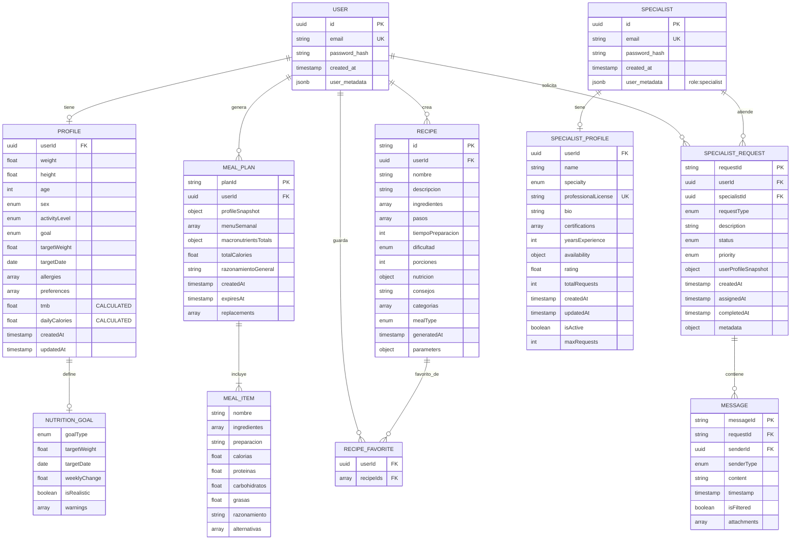

---

## Diagrama de Flujo de Usuario

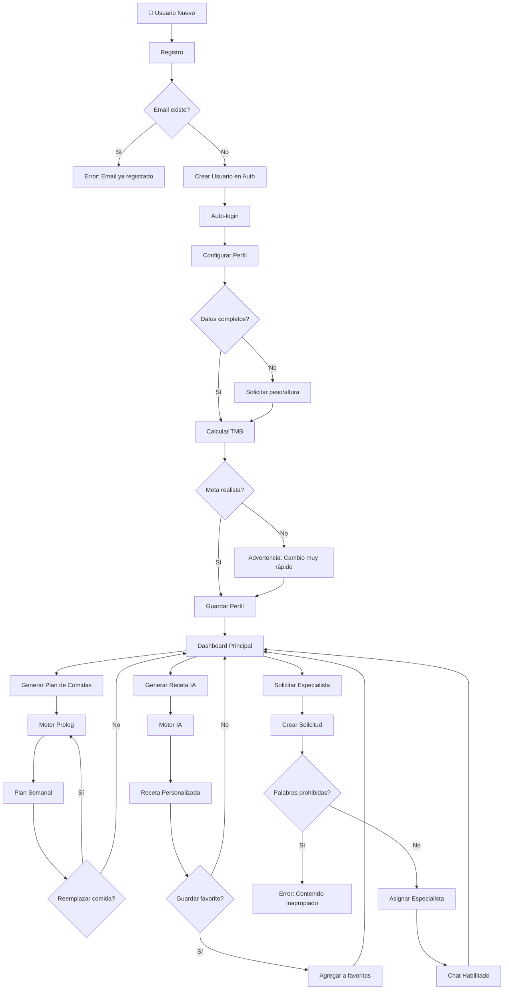

---

## Diagrama de Flujo de Especialista

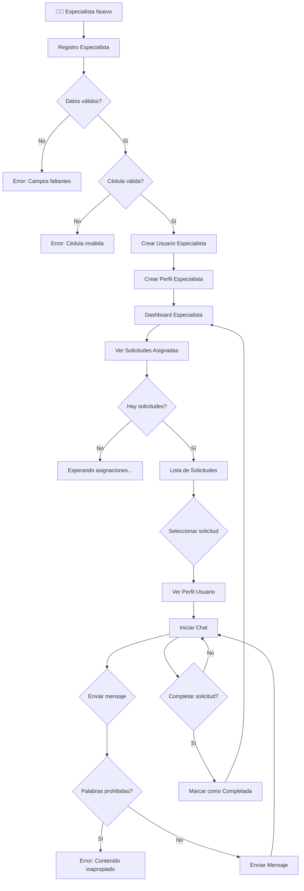

---

## Diagrama de Arquitectura del Sistema

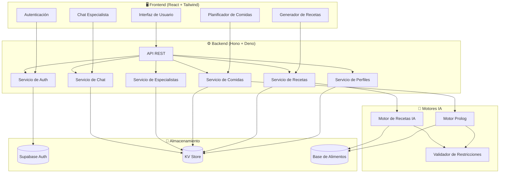

---

## Diagrama de Estados de Solicitud

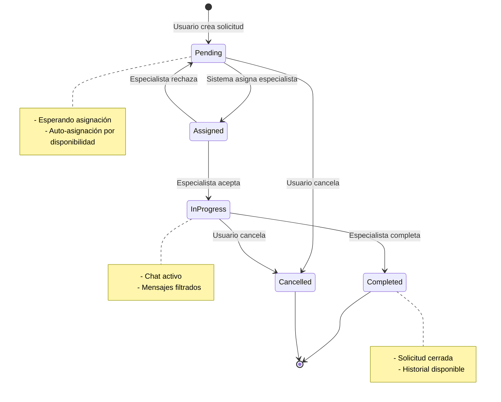

---

## Diagrama de Ciclo de Vida de Receta

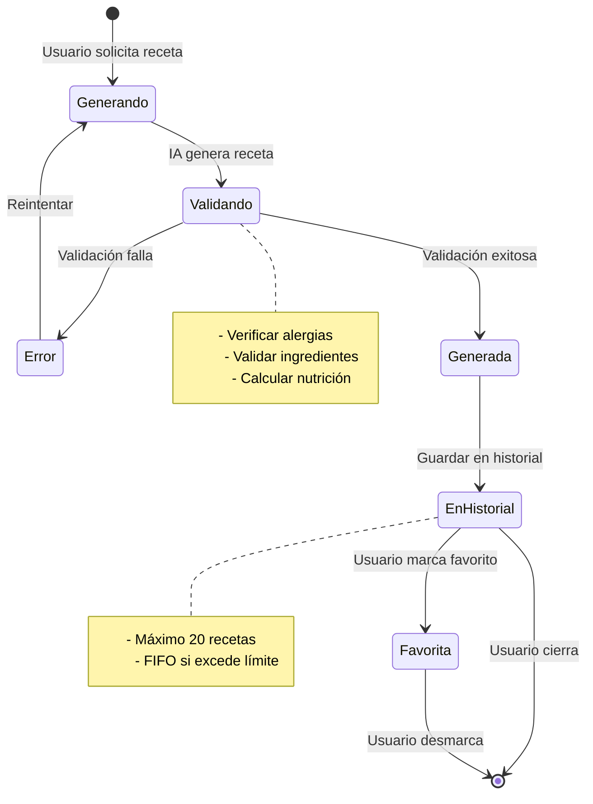

---

## Diagrama de Cálculo de TMB

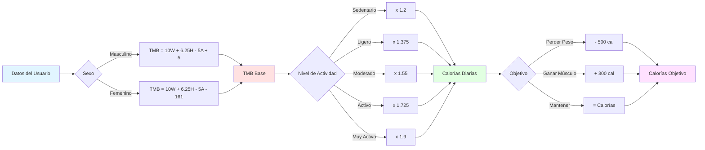

---

## Diagrama de Generación de Plan de Comidas (Prolog)

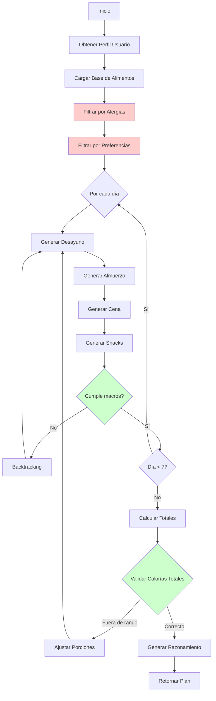

---

## Diagrama de Asignación Automática de Especialistas

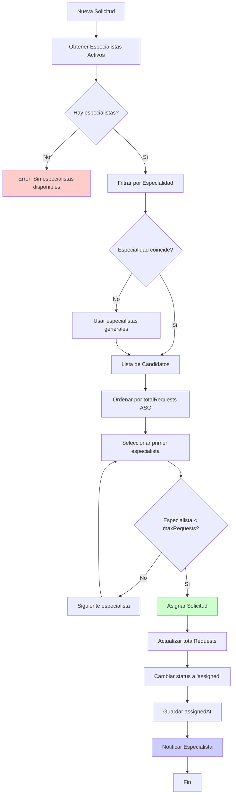

---

## Diagrama de Seguridad y Validación

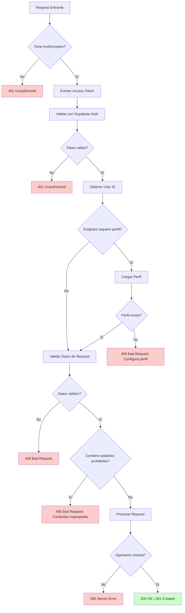

---

## Matriz de Acceso por Rol

| Endpoint | Usuario | Especialista | Público |
|----------|---------|--------------|---------|
| `POST /signup` | ✅ | ✅ | ✅ |
| `GET /profile` | ✅ (propio) | ❌ | ❌ |
| `PUT /profile` | ✅ (propio) | ❌ | ❌ |
| `POST /generate-menu` | ✅ | ❌ | ❌ |
| `POST /replace-meal` | ✅ | ❌ | ❌ |
| `POST /recipes/generate` | ✅ | ❌ | ❌ |
| `GET /recipes/history` | ✅ (propio) | ❌ | ❌ |
| `GET /recipes/favorites` | ✅ (propio) | ❌ | ❌ |
| `POST /specialist-signup` | ❌ | ✅ | ✅ |
| `GET /specialist-profile` | ❌ | ✅ (propio) | ❌ |
| `POST /specialist-requests` | ✅ | ❌ | ❌ |
| `GET /specialist/my-requests` | ❌ | ✅ (asignadas) | ❌ |
| `POST /specialist-requests/:id/messages` | ✅ (propias) | ✅ (asignadas) | ❌ |

---

## Diagrama de Datos en KV Store

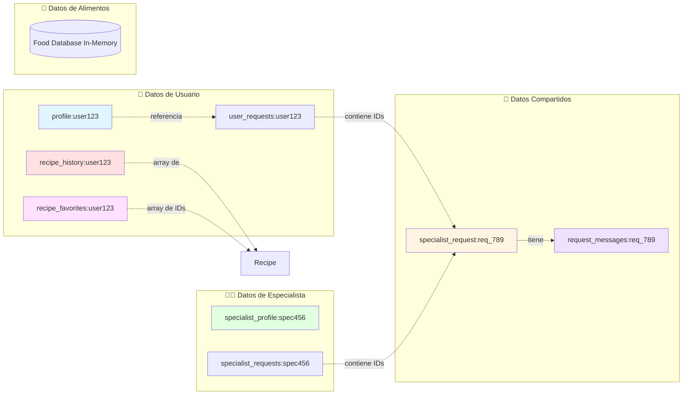

---

## Glosario de Términos

| Término | Descripción |
|---------|-------------|
| **TMB** | Tasa Metabólica Basal - Calorías que el cuerpo quema en reposo |
| **KV Store** | Key-Value Store - Sistema de almacenamiento clave-valor |
| **JSONB** | JSON Binary - Formato JSON optimizado para almacenamiento |
| **FK** | Foreign Key - Llave foránea |
| **PK** | Primary Key - Llave primaria |
| **UK** | Unique Key - Llave única |
| **FIFO** | First In First Out - Primero en entrar, primero en salir |
| **Prolog** | Lenguaje de programación lógica usado para inferencia |
| **Backtracking** | Técnica de búsqueda que retrocede cuando falla |
| **Snapshot** | Copia inmutable de datos en un momento específico |

---

**Nota**: Estos diagramas son visualizaciones del modelo de datos. Para ver el modelo completo con todas las especificaciones, consulta `DATABASE_MODEL.md`.
